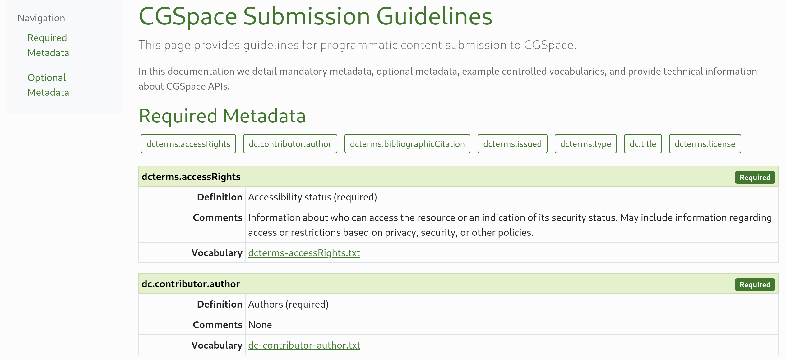

# CGSpace Submission Guidelines
A set of scripts to read `input-forms.xml` from DSpace and generate documentation about metadata and controlled vocabularies. This is used as guidance for programmatic submission to the CGSpace platform.

<p align="center">
  
</p>

## Requirements
Requires the following on the host machine:

- Python 3.7+ and pipenv
- Node.js and npm
- Hugo

## Preparation
Initialize the Python virtual environment with pipenv:

```console
$ pipenv install
```

Install dependencies with npm and build the static CSS and JavaScript assets:

```console
$ npm install
$ npm run build
```

## Usage
Make sure the Python virtual environment is active and then run `parse-input-forms.py` to extract and process the DSpace metadata and controlled vocabularies:

```console
$ pipenv shell
$ ./util/parse-input-forms.py -i ~/src/git/DSpace/dspace/config/input-forms.xml -c ~/src/git/DSpace/dspace/config/controlled-vocabularies --clean
```

Generate the documentation site using Hugo:

```console
$ hugo
```

You can view a local development version using `hugo serve`. The site will be available on: http://localhost:1313/cgspace-submission-guidelines/

## License
This work is licensed under the [GPLv3](https://www.gnu.org/licenses/gpl-3.0.en.html).

The license allows you to use and modify the work for personal and commercial purposes, but if you distribute the work you must provide users with a means to access the source code for the version you are distributing. Read more about the [GPLv3 at TL;DR Legal](https://tldrlegal.com/license/gnu-general-public-license-v3-(gpl-3)).
